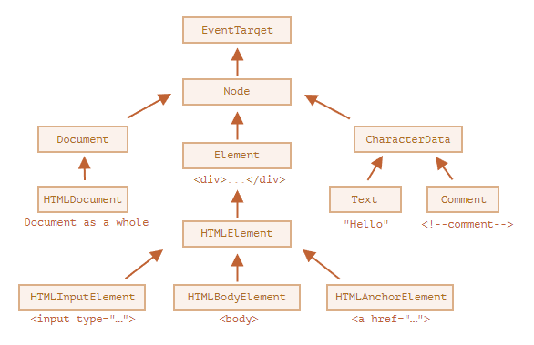

# html
## 层次结构
DOM 节点是常规的 JavaScript 对象，每个 DOM 节点都属于一个特定的类。这些类形成层次结构（hierarchy）。完整的属性和方法集是继承的结果。它们使用基于原型的类进行继承，可以使用 instanceof 来检查继承。


节点的 constructor 属性存储了构造函数
```javascript
document.body instanceof HTMLBodyElement
document.body instanceof EventTarget
```
在规范中，DOM 类不是使用 JavaScript 来描述的，而是一种特殊的 [接口描述语言（Interface description language）](https://en.wikipedia.org/wiki/Interface_description_language)，简写为 IDL，它通常很容易理解。
## html、body、head
```javascript
<html> = document.documentElement
// 可能为空，例如script标签在head中。
<body> = document.body
<head> = document.head
```
## 节点
节点包含文本节点、注释节点和元素。document不是元素节点。
```javascript
document.documentElement.parentNode = document
document.documentElement.parentElement = null
```
## JS获取元素
所有的 "getElementsBy*" 方法都会返回一个 实时的（live） 集合。这样的集合始终反映的是文档的当前状态，并且在文档发生更改时会“自动更新”。
- getElementById只能在document上调用。
- elem.querySelectorAll(css)，它返回 elem 中与给定 CSS 选择器匹配的所有元素。可以使用任何CSS选择器，包括伪类。
- elem.querySelector(css) 调用会返回给定 CSS 选择器的第一个元素。
- elem.matches(css) 不会查找任何内容，它只会检查 elem 是否与给定的 CSS 选择器匹配。它返回 true 或 false。
- elem.closest(css) 方法会查找与 CSS 选择器匹配的最近的祖先。elem 自己也会被搜索。
- elem.getElementsByTagName(tag) 查找具有给定标签的元素，并返回它们的集合。tag 参数也可以是对于“任何标签”的星号 "*"。
- elem.getElementsByClassName(className) 返回具有给定CSS类的元素。
- document.getElementsByName(name) 返回在文档范围内具有给定 name 特性的元素。很少使用。

一种用来检查子级与父级之间关系的方法，因为它有时很有用：

如果 elemB 在 elemA 内（elemA 的后代）或者 elemA==elemB，elemA.contains(elemB) 将返回 true。
## navigation property
给定一个 DOM 节点，我们可以使用导航（navigation）属性访问其直接的邻居。
这些属性主要分为两组：
对于所有节点：parentNode，childNodes，firstChild，lastChild，previousSibling，nextSibling。
仅对于元素节点：parentElement，children，firstElementChild，lastElementChild，previousElementSibling，nextElementSibling。
## DOM属性
某些类型的 DOM 元素可能会提供特定于其类型的其他属性。
table元素支持以下属性：
table.rows，tr元素的集合。
table.caption/tHead/tFoot，引用元素 caption，thead，tfoot。
table.tBodies， tbody元素的集合（根据标准还有很多元素，但是这里至少会有一个，即使没有被写在 HTML 源文件中，浏览器也会将其放入 DOM 中）。
thead，tfoot，tbody元素提供了 rows 属性：
tbody.rows，表格内部 <tr> 元素的集合。
tr：
tr.cells，在给定 tr 中的 td 和 th 单元格的集合。
tr.sectionRowIndex， 给定的 tr 在封闭的 thead/tbody/tfoot 中的位置（索引）。
tr.rowIndex，在整个表格中 tr 的编号（包括表格的所有行）。
td 和 th：
td.cellIndex， 在封闭的 tr 中单元格的编号。
### nodeName和tagName
给定一个 DOM 节点，我们可以从 nodeName 或者 tagName 属性中读取它的标签名。

tagName 和 nodeName 的差异：
- tagName 属性仅适用于 Element 节点。
- nodeName 是为任意 Node 定义的：
  - 对于元素，它的意义与 tagName 相同。
  - 对于其他节点类型（text，comment 等），它拥有一个对应节点类型的字符串。

标签名称始终是大写的，除非是在 XML 模式下。
### innerHTML
innerHTML 属性允许将元素中的 HTML 获取为字符串形式。可以被修改。
如果 innerHTML 将一个 <script> 标签插入到 document 中 —— 它会成为 HTML 的一部分，但是不会执行。
### outerHTML
outerHTML 属性包含了元素的完整 HTML。就像 innerHTML 加上元素本身一样。

与 innerHTML 不同，写入 outerHTML 不会改变元素。而是在 DOM 中替换它。例如：
```javascript
<div>Hello, world!</div>

<script>
  let div = document.querySelector('div');

  // 使用 <p>...</p> 替换 div.outerHTML
  div.outerHTML = '<p>A new element</p>'; // (*)

  // 蛤！'div' 还是原来那样！
  alert(div.outerHTML); // <div>Hello, world!</div> (**)
</script>
```
在外部文档（DOM）中我们可以看到的是新内容而不是 <div>。但旧的 div 变量并没有被改变。
outerHTML 赋值不会修改 DOM 元素（在这个例子中是被 ‘div’ 引用的对象），而是将其从 DOM 中删除并在其位置插入新的 HTML。

所以，在 div.outerHTML=... 中发生的事情是：
1. div 被从文档（document）中移除。
2. 另一个 HTML 片段 <p>A new element</p> 被插入到其位置上。
3. div 仍拥有其旧的值。新的 HTML 没有被赋值给任何变量。

### nodeValue/data：文本节点内容
innerHTML 属性仅对元素节点有效。

其他节点类型，例如文本节点，具有它们的对应项：nodeValue 和 data 属性。这两者在实际使用中几乎相同，只有细微规范上的差异。因此，我们将使用 data，因为它更短。
### textContent：纯文本
textContent 提供了对元素内的 文本 的访问权限：仅文本，去掉所有 <tags>。例如：
```javascript
<div id="news">
  <h1>Headline!</h1>
  <p>Martians attack people!</p>
</div>

<script>
  // Headline! Martians attack people!
  alert(news.textContent);
</script>
```
一般用到这样的文本读取场景较少，写入 textContent 要有用得多，因为它允许以“安全方式”写入文本。

假设我们有一个用户输入的任意字符串，我们希望将其显示出来。
- 使用 innerHTML，我们将其“作为 HTML”插入，带有所有 HTML 标签。
- 使用 textContent，我们将其“作为文本”插入，所有符号（symbol）均按字面意义处理。
### hidden属性
从技术上来说，hidden 与 style="display:none" 做的是相同的事。但 hidden 写法更简洁。
### 受支持属性列表
如果我们想知道给定类的受支持属性的完整列表，我们可以在规范中找到它们。例如，在 https://html.spec.whatwg.org/#htmlinputelement 中记录了 HTMLInputElement。
## 浏览器的默认行为
1. 忽略head之前的空格和换行符。<br>
2. body标签之后的内容会被移动到body内最下方。HTML 规范要求所有内容必须位于 <body> 内。所以 </body> 之后不能有空格。<br>
3. 浏览器如果浏览器遇到格式不正确的 HTML，它会在形成 DOM 时自动更正它。例如，闭合没有关闭标签的p、li等标签，创建html标签，即使不存在。
## 文档
WHATWG HTML规范，MDN
