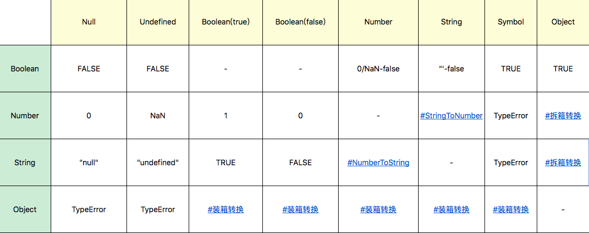

# 类型
7种语言类型：
- undefined
- null
- boolean
- string
- number
- symbol
- object

## undefined、null
undefined是一个变量，而并非是一个关键字，为了避免无意中被篡改，我建议使用 void 0 来获取undefined值。

Null 类型也只有一个值，就是 null，它的语义表示空值，与 undefined 不同，null 是 JavaScript 关键字，所以在任何代码中，你都可以放心用 null 关键字来获取 null 值。
## string
String 有最大长度是 2^53 - 1，但这个最大长度并不完全是理解中的字符数。

因为String 的意义并非“字符串”，而是字符串的 UTF16 编码，我们字符串的操作 charAt、charCodeAt、length 等方法针对的都是 UTF16 编码。所以，字符串的最大长度，实际上是受字符串的编码长度影响的。
> 现行的字符集国际标准，字符是以 Unicode 的方式表示的，每一个 Unicode 的码点表示一个字符，理论上，Unicode 的范围是无限的。
> UTF是Unicode的编码方式，规定了码点在计算机中的表示方法，常见的有 UTF16 和 UTF8。 Unicode 的码点通常用 U+??? 来表示，其中 ??? 是十六进制的码点值。
> 0-65536（U+0000 - U+FFFF）的码点被称为基本字符区域（BMP）。

JavaScript 中的字符串是永远无法变更的。JavaScript 字符串把每个 UTF16 单元当作一个字符来处理，所以处理非BMP（超出 U+0000 - U+FFFF 范围）的字符时，你应该格外小心。
## number
JavaScript中的Number类型有 18437736874454810627(即2^64-2^53+3) 个值。JavaScript 中的 Number 类型基本符合 IEEE 754-2008 规定的双精度浮点数规则，规定了几个例外情况：
- NaN，表示9007199254740990个特殊值被占用
- Infinity，无穷大
- -Infinity，负无穷大

另外，JavaScript中有 +0 和 -0，在加法类运算中它们没有区别，但是除法的场合则需要特别留意区分，“忘记检测除以-0，而得到负无穷大”的情况经常会导致错误，
而区分 +0 和 -0 的方式，正是检测 1/x 是 Infinity 还是 -Infinity。

根据双精度浮点数的定义，Number类型中有效的整数范围是-0x1fffffffffffff至0x1fffffffffffff，所以Number无法精确表示此范围外的整数。

同样根据浮点数的定义，非整数的Number类型无法用等号比较，例如0.1+0.2==0.3。正确的比较方法是使用JavaScript提供的最小精度值：
```
Math.abs(0.1 + 0.2 - 0.3) <= Number.EPSILON
```
## symbol
Symbol 可以具有字符串类型的描述，但是即使描述相同，Symbol也不相等。创建 Symbol 的方式是使用全局的 Symbol 函数，传入字符串类型的描述。

标准中定义了一些Symbol接口，例如Symbol.iterator定义对象迭代器。
## object
对于基本类型而言，. 运算符提供了装箱操作，它会根据基础类型构造一个临时对象，使得我们能在基础类型上调用对应对象的方法。
## 类型转换

### 装箱转换
装箱转换，正是把基本类型转换为对应的对象。使用内置的 Object 函数，我们可以在JavaScript代码中显式调用装箱能力。

装箱机制会频繁产生临时对象，在一些对性能要求较高的场景下，我们应该尽量避免对基本类型做装箱转换。
### 拆箱转换
ToPrimitive 函数，它是对象类型到基本类型的转换（拆箱转换）。

对象到 String 和 Number 的转换，先把对象变成基本类型，再从基本类型转换为对应的 String 或者 Number。

拆箱转换会尝试调用 valueOf 和 toString 来获得拆箱后的基本类型。如果 valueOf 和 toString 都不存在，或者没有返回基本类型，则会产生类型错误 TypeError。

ES6支持指定Symbol.toPrimitive设置拆箱转换行为。
