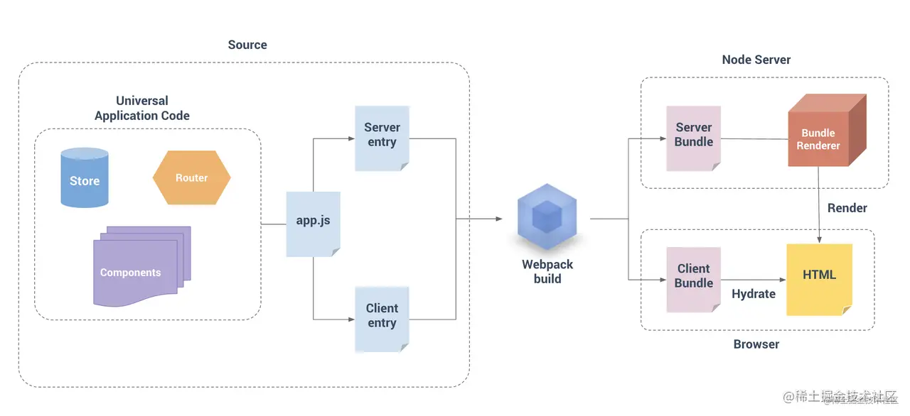

SPA 已经能解决很多问题，但却引入一些新的问题：
- SEO 不友好：大多数搜索引擎对网页内容的解读都依赖于同步 HTML 内容 —— 假设你的应用最开始只是展示了一个加载动画，然后通过 Ajax 获取异步数据进行渲染，爬虫并不会等待异步操作完成后才解析页面的内容，所以 SPA 应用通常无法向爬虫提供任何有用信息；
- Time-To-Content 更长：由于客户端需要等待所有 JavaScript 资源都加载完毕后，才会开始渲染页面真正有意义的内容，所以 TTC 时间相对更长。

在 Vue 场景下，通常可以选择 Nuxt.js、Quasar、@vue/server-renderer 等方案实现 SSR，这些技术的底层逻辑都包含三个大的步骤：

- 编译时，将同一组件构建为适合在客户端、服务器运行的两份副本；
- 服务端接收到请求时，调用 Render 工具将组件渲染为 HTML 字符串，并返回给客户端；
- 客户端运行 HTML，并再次执行组件代码，“激活(Hydrate)” 组件。

例子：https://github.com/1f606/webpack-book-samples/tree/main/5-2_use-ssr

SSR也带来了新问题：
- 更高的架构复杂度，这意味着更高的维护、扩展、学习成本；
- Node 与浏览器环境不完全匹配，部分浏览器特定的代码，只能在某些生命周期钩子函数中使用；一些外部扩展库 (external library) 可能需要特殊处理，才能在 SSR 中运行；
- 组件要求更高，需要兼容 Node.js Server 运行环境；
- 服务端负载更高，毕竟相较于纯粹提供静态资源的 SPA 形式，SSR 需要在 Node 进程中执行大量 CPU 运算以渲染 HTML 片段。

因此，对于用户不敏感的应用，如公司官网、营销活动页等，还可以使用 [Static Site Generation](https://github.com/chrisvfritz/prerender-spa-plugin) (或叫 Pre-renderer) 方式，在编译构建阶段提前生成各页面的静态 HTML 代码，这样技能满足 SEO 需求，又尽可能降低架构、编码复杂度。

但目前该插件只支持webpack4，不兼容webpack5。
